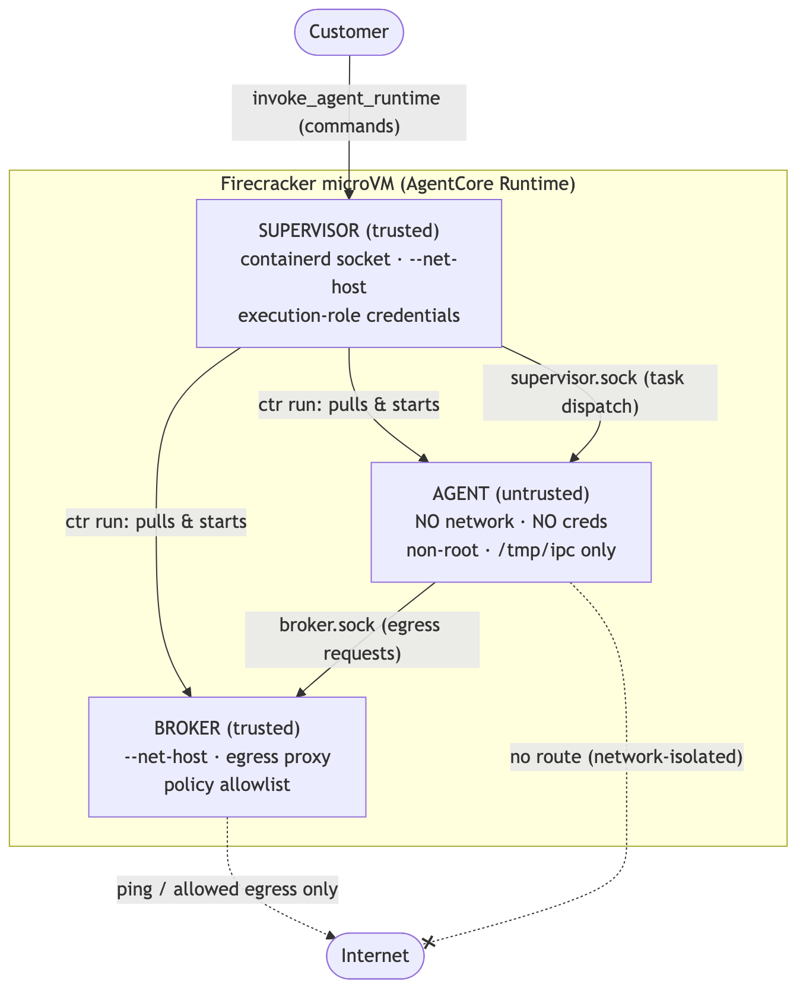

# Egress-Controlled Code Execution

## Overview

This sample demonstrates how to run **untrusted code** securely inside an Amazon Bedrock
AgentCore Runtime microVM. Three independently deployable containers collaborate so that
customer code never touches the network, credentials, or the container control plane
directly:

- **Supervisor** — trusted orchestrator. Runs as a `BedrockAgentCoreApp`, receives
  customer commands via the AgentCore Runtime API, and drives containerd (via `ctr`) to
  pull and manage the broker and agent containers.
- **Broker** — trusted egress proxy. All external access from the agent flows through it,
  and every request is validated against a runtime-configurable allowlist.
- **Agent** — the untrusted sandbox. No network, no credentials, no containerd socket —
  it can only reach the broker over a Unix-domain IPC socket.

The working Phase 1 operation is `ping_domain`, which exercises the full
supervisor → agent → broker → egress path with policy enforcement. The allow-vs-deny
contrast (an allowed domain pings, a blocked domain is denied by the broker) is the
security boundary this sample demonstrates.

### Use case details

| Information         | Details                                                                 |
|---------------------|-------------------------------------------------------------------------|
| Use case type       | Security / sandboxed execution                                          |
| Agent type          | Multi-container (supervisor / broker / agent)                           |
| Use case components | AgentCore Runtime, containerd (`ctr`), Unix-socket IPC, egress allowlist |
| Use case vertical   | Platform / infrastructure security                                      |
| Example complexity  | Advanced                                                                |
| SDK used            | Amazon Bedrock AgentCore SDK (`bedrock-agentcore`), boto3               |

## How this sample is different

Unlike the other runtime samples in this folder — which ship a single agent as code
(zipped to S3 via `codeConfiguration`) — this sample is **container-based**. You build and
push **three** `linux/arm64` images to ECR, and the runtime is created from the
`supervisor` image via `containerConfiguration`. There is no `entryPoint`/zip step; each
image runs its own Dockerfile `CMD`.

It also relies on one platform assumption that the other samples do not: **the supervisor
drives `containerd` inside the AgentCore Runtime microVM**. When the supervisor receives
`start_broker` / `start_agent`, it shells out to `ctr` (against
`/run/containerd/containerd.sock`) to pull each image from ECR and launch the broker and
agent as sibling containers *inside the same microVM*. The broker is launched with
`--net-host` (it can reach the network); the agent is launched **without** it (isolated
network namespace, loopback only) — that asymmetry is the security boundary. If the
runtime environment does not expose a usable containerd socket to the supervisor, the
`start_*` commands will fail; this is expected and central to how the sample works.

## Key features

- **Network-isolated agent** — the untrusted container runs with its own network
  namespace (loopback only); it has no route to the internet or to IMDS.
- **Broker-mediated egress** — the agent can only act on the outside world by asking the
  broker, which enforces an allowlist per operation.
- **Runtime-configurable policy** — allowlists are updated live via the `configure_broker`
  command, no container restart required.
- **Length-prefixed JSON IPC** — a small shared protocol (`shared/ipc.py`) over Unix
  domain sockets connects the components.

## Architecture



The supervisor is the only container the runtime starts; it launches the broker and agent
itself via containerd. Only the broker reaches the internet — the agent is network-isolated
and must ask the broker over `broker.sock`. The supervisor commands, IPC protocol, and full
security model are detailed in the sections below.

## Project Structure

```
12-egress-coding-execution/
├── deploy.py            # Check images in ECR, create the runtime, wait until READY
├── invoke.py            # Run the demo: start broker/agent, configure, ping allow + deny
├── cleanup.py           # Stop containers, delete the runtime (--delete-ecr also drops repos)
├── requirements.txt     # boto3 (for the deploy/invoke/cleanup scripts)
├── requirements-dev.txt # + pytest (for running the unit tests)
├── shared/
│   └── ipc.py                 # Length-prefixed JSON IPC framing (send/recv), shared by all three
├── supervisor/                # TRUSTED orchestrator image (the one the runtime starts)
│   ├── Dockerfile             # python:3.12-slim + containerd client (ctr)
│   ├── requirements.txt       # image deps: bedrock-agentcore, boto3
│   └── src/
│       ├── main.py            # BedrockAgentCoreApp entrypoint + command router
│       ├── containerd.py      # ctr wrappers: pull / start / stop / status
│       ├── ecr.py             # fetch an ECR auth token (boto3) for image pulls
│       ├── profiles.py        # build the ctr run args (broker = --net-host, agent = isolated)
│       └── task_dispatch.py   # supervisor→agent IPC over supervisor.sock (TaskDispatcher)
├── broker/                    # TRUSTED egress proxy image
│   ├── Dockerfile             # python:3.12-slim + iputils-ping (stdlib-only otherwise)
│   └── src/
│       ├── main.py            # start the asyncio Unix-socket IPC server
│       ├── ipc_server.py      # accept agent connections, route methods to handlers
│       ├── config.py          # BrokerConfig: mutable allowlist state + configure handler
│       └── handlers/
│           ├── ping.py        # ping proxy, enforces ALLOWED_PING_DOMAINS
│           └── http.py        # HTTP proxy (Phase 2 stub → NOT_IMPLEMENTED)
├── agent/                     # UNTRUSTED sandbox image (no network, no creds, non-root)
│   ├── Dockerfile             # python:3.12-slim, runs as USER sandbox (UID 1000)
│   └── src/
│       ├── agent_main.py      # task loop: wait on supervisor.sock, proxy pings via broker.sock
│       └── ipc_client.py      # Unix-socket client (connect / request / wait_for_message)
├── images/                    # architecture diagram (architecture.png)
└── tests/                     # Unit tests for the IPC framing and the broker allowlist
```

## Prerequisites

| Requirement | Description |
|-------------|-------------|
| Python 3.12+ | To run the `deploy.py` / `invoke.py` / `cleanup.py` scripts |
| Docker with buildx | To build the three `linux/arm64` container images |
| AWS account + credentials | For ECR image pulls and Bedrock AgentCore Runtime invocations |
| An Amazon ECR repository | Three repos: `egress-coding-execution/{supervisor,broker,agent}` |
| An IAM execution role | `deploy.py` creates one (ECR pull + CloudWatch Logs) if you don't set `ROLE_ARN` |

Install the script dependencies:

```bash
cd amazon-bedrock-agentcore-samples/01-features/02-host-your-agent/01-runtime/03-advanced/12-egress-coding-execution
pip install -r requirements.txt
```

## Building and pushing the images

All images are built for `linux/arm64` (AgentCore Runtime is ARM64) and pushed to ECR.
Run from the sample root, and replace `<account-id>` and the region with your own. On a
non-arm64 host, enable emulation first with
`docker run --privileged --rm tonistiigi/binfmt --install arm64`.

```bash
REGION=us-east-1
REGISTRY=<account-id>.dkr.ecr.${REGION}.amazonaws.com/egress-coding-execution

# Create the three repositories (once)
for c in supervisor broker agent; do
  aws ecr create-repository --repository-name egress-coding-execution/$c --region ${REGION}
done

# Authenticate with ECR
aws ecr get-login-password --region ${REGION} \
  | docker login --username AWS --password-stdin <account-id>.dkr.ecr.${REGION}.amazonaws.com

# Build & push each image
docker buildx build --platform linux/arm64 -f supervisor/Dockerfile -t ${REGISTRY}/supervisor:latest --push .
docker buildx build --platform linux/arm64 -f broker/Dockerfile     -t ${REGISTRY}/broker:latest --push .
docker buildx build --platform linux/arm64 -f agent/Dockerfile      -t ${REGISTRY}/agent:latest --push .
```

## Deployment

The three scripts share a `runtime_config.json` written by `deploy.py`. Set your AWS
region and credentials in the environment first (the scripts read the default boto3
session). Edit the parameters at the top of `deploy.py` (`ROLE_NAME`, `ECR_REPO`,
`RUNTIME_NAME`) if you used different names.

```bash
# 1. Create the AgentCore Runtime from the supervisor image (waits until READY)
python deploy.py

# 2. Run the end-to-end demo (start broker + agent, configure the allowlist,
#    then ping an allowed domain and a blocked one)
python invoke.py

# 3. Tear down the runtime. Add --delete-ecr to also delete the three ECR repos,
#    and --delete-role to delete the IAM role (only if deploy.py created it).
python cleanup.py
```

`deploy.py` verifies the three images exist in ECR, creates (or reuses) the runtime, and
waits for status `READY`. `invoke.py` drives one session through the full flow:

```
start_broker → start_agent → configure_broker (allowlist: amazon.com) → status
  → ping_domain amazon.com      (ALLOW: broker permits it, ping executes)
  → ping_domain aws.amazon.com  (DENY:  blocked — subdomain not in the allowlist)
```

Both domains are Amazon's. The allowlist entry `amazon.com` is an **exact match**, so the
subdomain `aws.amazon.com` is denied — demonstrating that the policy is a strict allowlist,
not a substring/suffix match (use a glob like `*.amazon.com` to allow subdomains).

The **ALLOW** result confirms the broker let the request through and the ping executed —
we do not assert ICMP reachability, because inside the microVM the echo replies may not
complete (a non-zero exit code there is a network-path artifact, not a policy denial). The
**DENY** result is the broker rejecting the domain against its allowlist:

```json
{"status":"ok","result":{"exit_code":-1,"stdout":"","stderr":"Domain not in ping allowlist: aws.amazon.com","domain":"aws.amazon.com","count":3,"timeout":5}}
```

## Running tests

The unit tests cover the two security-critical, pure-Python pieces without any AWS calls:
the length-prefixed IPC framing (`shared/ipc.py`) and the broker's allowlist policy
(`broker/src/config.py`, including glob matching and default-deny).

```bash
pip install -r requirements-dev.txt
pytest
```

## Supervisor commands

The supervisor is a stateless command router (`BedrockAgentCoreApp` entrypoint). Every
command is a JSON payload `{"command": ..., "params": {...}}` sent via
`invoke_agent_runtime` on one session:

| Command | Parameters | Action |
|---------|-----------|--------|
| `start_broker` | `image_uri`, `env` | Pull the broker image from ECR and start it with the trusted profile (`--net-host`). `env` is passed as container env vars. |
| `start_agent` | `image_uri` | Pull the agent image and start it with the untrusted profile (no `--net-host`). |
| `configure_broker` | `allowed_ping_domains`, `allowed_domains` | Update the broker allowlists at runtime via IPC — no restart. |
| `ping_domain` | `domain`, `count`, `timeout` | Dispatch a ping task to the agent (proxied through the broker); returns the result synchronously. |
| `status` | — | Report the state of the broker and agent containers. |
| `list_containers` | — | Return the raw containerd view (`ctr tasks ls` / `containers ls`) for debugging. |
| `stop_agent` / `stop_broker` | — | Kill and remove the container. |

`ping_domain` exercises the full path: the supervisor dispatches the task to the agent
over `supervisor.sock`; the agent asks the broker to `ping` over `broker.sock`; the broker
validates the domain against `ALLOWED_PING_DOMAINS` (fnmatch globs like `*.amazon.com`) and
only then runs `ping`. A denied domain never reaches `ping`.

## IPC protocol

The three containers talk over two Unix-domain sockets on a shared bind mount
(`/run/containerd/sandbox-ipc` on the microVM → `/tmp/ipc` in each container):

| Socket | Listener | Connector | Purpose |
|--------|----------|-----------|---------|
| `broker.sock` | Broker | Agent | Egress proxy (ping; HTTP/secrets are Phase 2) |
| `supervisor.sock` | Supervisor | Agent | Task dispatch (`ping_domain`) |

Framing is a 4-byte big-endian length prefix followed by a UTF-8 JSON payload
(`shared/ipc.py`). Requests carry `{id, method, params}`; responses carry
`{id, status, result}` or `{id, status:"error", error:{code, message}}`.

## Security model

| Component | Trust | Network | Credentials | containerd socket |
|-----------|-------|---------|-------------|-------------------|
| Supervisor | Trusted | Host (`--net-host`) | Execution role (IMDS) | Yes |
| Broker | Trusted | Host (`--net-host`) | Optional, scoped | No |
| Agent | **Untrusted** | **None (loopback only)** | **None** | **No** |

| Attack vector | Mitigation |
|---------------|------------|
| Agent reaches the network / IMDS | Isolated network namespace (no `--net-host`) → no route to `169.254.169.254` |
| Agent drives containerd | Socket is never mounted into the agent |
| Agent reads broker/supervisor state | Separate mount and PID namespaces |
| Agent escalates privileges | Non-root (UID 1000), no added capabilities |
| Agent reaches unauthorized domains | Broker validates every request against the allowlist |

**Phase 1 hardening relies on** omitting `--net-host` for network isolation and the
Dockerfile `USER sandbox` (UID 1000) for non-root execution. Explicit namespace flags,
capability dropping, and cgroup memory/CPU limits are **deferred to Phase 2** and should be
added before any non-experimental use.

## Current status

Only **Phase 1** is implemented: the supervisor/broker/agent architecture with
`ping_domain` as the working egress-controlled operation. HTTP proxying, secret
retrieval, rate limiting, and explicit cgroup/namespace hardening are stubbed or deferred
to Phase 2.

## Disclaimer

The examples provided in this repository are for **experimental and educational purposes
only**. They demonstrate concepts and techniques but are not intended for direct use in
production environments. Before adapting this pattern, complete the Phase 2 hardening
described in the [Security model](#security-model) above, and use
[Amazon Bedrock Guardrails](https://docs.aws.amazon.com/bedrock/latest/userguide/prompt-injection.html)
to protect against prompt injection.
