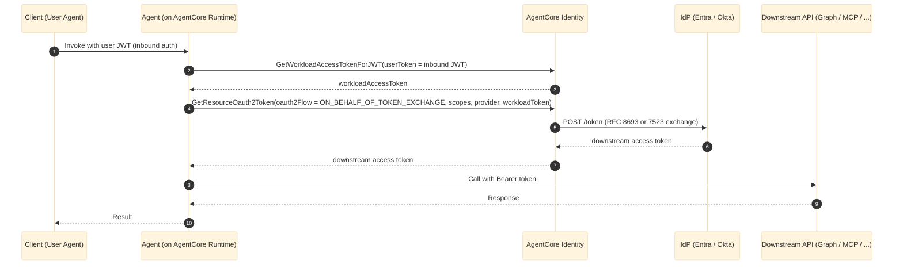
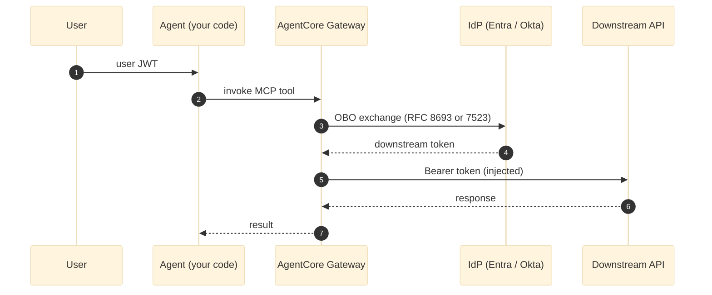
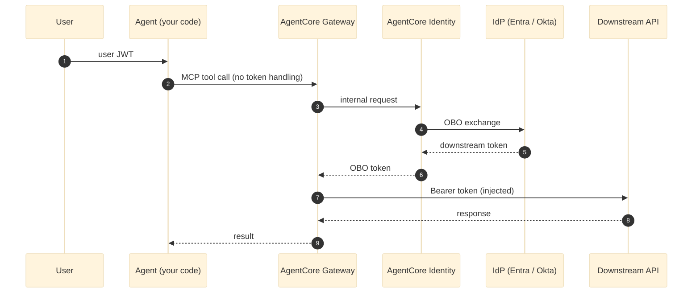

# On-Behalf-Of (OBO) token exchange

OAuth is a delegation protocol - it lets a service call other services on behalf of a user, without the user needing to hand over their credentials. This works cleanly when a single application calls a single backend API. But real systems rarely stay that simple. In an agentic architecture, that backend API often needs to call another downstream service - and that's where token propagation gets tricky.

There are three ways to handle identity across these hops:

1. **Impersonation** (not recommended) - the agent forwards the user's original token directly to the downstream service. The token carries the wrong audience and likely too broad a scope, creating a significant security risk.

2. **Service identity** (not recommended) - the agent drops the user's identity entirely and calls downstream as itself, using its own credentials. The downstream service loses all context of who originally authorized the action.

3. **On-Behalf-Of (OBO)** - the agent re-issues a token that preserves who the user is, targets the right resource, and constrains permissions to only what both the user and the calling agent are permitted to do.

OBO is an OAuth 2.0 delegation pattern where an agent carries the user's identity forward when calling downstream APIs, so every hop in the chain knows both who authorized the action and what entity is executing it.

Amazon Bedrock AgentCore Identity implements this pattern for agentic systems. The user authenticates once. Before each hop, AgentCore automatically exchanges the current token for a new one scoped specifically to that next operation. Each issued token carries the original user identity (represented by the `sub` claim), the target resource (represented by the `aud` claim), and the identity of the agent acting on their behalf (represented by the `act` claim). No re-authentication required at any step.

## Where can OBO be used?

OBO applies any time a service makes an authenticated call on behalf of a user.

**When to use OBO**

- **Agent calling an MCP server** - the MCP server's tools run with the user's permissions, not the agent's. For example, reading the user's calendar, not every calendar in the org.
- **Agent calling another agent** - each agent in the chain executes part of the task on behalf of the original user. OBO carries the user identity and delegation trail through every hop. For example, a research agent passing context to a writing agent, with the original user's identity intact throughout.
- **Agent calling a third-party API** - when an agent calls a tool wrapping Graph, Salesforce, or a ticketing system, the tool gets a token scoped to that user for that specific service, not a broad app-wide token. For example, creating a Salesforce opportunity as the user, not as the agent's service account.
- **Multi-tenant SaaS agents** - the agent acts for a specific user in a specific tenant. OBO prevents it from accidentally using its own elevated credentials across all tenants' data. For example, an agent serving Alice at Acme and Bob at Globex never crosses tenant boundaries, even running on shared infrastructure.
- **Cross-trust-domain integrations** - when a chain crosses multiple IdPs, OBO handles delegation within a single trust domain while federation handles the cross-domain handoff, keeping user context intact end-to-end. For example, an agent authenticated via Okta calling a downstream service secured by Azure AD.

**When OBO does not apply**

- **App-only work** - if the task is truly autonomous with no user context needed, client credentials is simpler and more appropriate. For example, a nightly batch job syncing product inventory has no user to act on behalf of.
- **Long-running background jobs** - if the original user session may have expired by the time the work runs, OBO tokens won't hold up. For example, a report scheduled to run 8 hours after the user logged off needs a different delegation model.
- **Public clients with no server-side component** - OBO needs a confidential client to safely hold credentials and perform the exchange. For example, a pure browser app or mobile app with no backend cannot participate in OBO.
- **Cross-IdP identity translation** - OBO delegates within a single IdP trust domain, it does not translate identities across IdPs. For example, mapping a user authenticated in Okta to an identity in Azure AD is a federation problem, not an OBO problem.

## AgentCore Identity

Amazon Bedrock AgentCore Identity is an identity and credential management service designed specifically for AI agents and automated workloads. It provides secure authentication, authorization, and credential management capabilities that enable agents and tools to access AWS resources and third-party services on behalf of users while helping to maintain strict security controls and audit trails. 

Amazon Bedrock AgentCore Identity service acts as a credential broker inside the AWS boundary and supports On-Behalf-Of (OBO) token exchange, enabling agents and other workloads. Instead of building token exchange logic into every agent or MCP server, you configure AgentCore Identity once with your IdP credentials. At runtime, it accepts the inbound user token, performs the OBO exchange with your IdP, caches the resulting token in its Token Vault, and returns a downstream-scoped token to your agent. Your agent never holds a client secret, never constructs an exchange request, and never calls your IdP directly.

### Example

Say you want to build an AI assistant that can summarize a user's unread emails using OBO. The downstream resource is Microsoft Graph, exposed to your agent running on Agentcore Runtime through an MCP server.

Behind the scenes, four systems have to cooperate: the frontend the user logged into, the AI agent interpreting the request, an MCP server exposing Microsoft Graph as a tool, and the Graph API holding the user's emails. Every hop needs the user's identity carried forward - but each hop should only get a token scoped to its specific downstream target.



**Token claims at each hop**

**1. Inbound user JWT (Client → Agent)**
```json
{
  "sub": "alice@contoso.com",
  "aud": "api://my-agent",
  "act": null
}
```

**2. Workload access token (Agent → AgentCore Identity)**
```json
{
  "sub": "workload/my-agent",
  "aud": "agentcore.amazonaws.com",
  "act": {
    "sub": "alice@contoso.com"
  }
}
```

**3. OBO exchange assertion (AgentCore Identity → IdP)**
```json
{
  "sub": "alice@contoso.com",
  "aud": "https://login.microsoftonline.com/{tenant}/oauth2/v2.0/token",
  "act": {
    "sub": "workload/my-agent"
  }
}
```

**4. Downstream access token (IdP → AgentCore → Agent)**
```json
{
  "sub": "alice@contoso.com",
  "aud": "https://graph.microsoft.com",
  "act": {
    "sub": "workload/my-agent"
  },
  "scp": "Mail.Read"
}
```

### Building blocks and call sequence:

- **OAuth 2.0 Credential Provider** - where you register your IdP with AgentCore. It stores the client ID, client secret, discovery URL, grant type, and OBO exchange configuration needed to perform exchanges on your behalf. In the email example, the agent and the MCP server both share the same credential provider without ever seeing the underlying credentials. You create one per IdP and reuse it across as many workloads as you need.

- **Workload Identity** - represents your agent or MCP server inside AgentCore. In the email example, the AI agent has one workload identity and the MCP server has another - each attached to the same credential provider, but each getting tokens scoped to their specific downstream target.

When your agent needs to call a downstream API on behalf of a user, AgentCore Identity handles the credential exchange through two API calls.

**Step 1: Wrap the user's identity**

Call `GetWorkloadAccessTokenForJWT`, passing in your workload name and the JWT that came in with the user's request:

```
Input:
  workload_name     → your agent's registered workload
  user_token        → the inbound user JWT

Output:
  workloadAccessToken
```

AgentCore returns a workload access token - an AWS-internal token that carries the user's identity forward. The downstream IdP never sees this token directly; it's just a secure way for AgentCore to hold onto who the user is.

**Step 2: Get a token for the downstream resource**

Pass the workload token from Step 1 into `GetResourceOauth2Token`, along with the scopes you need and the name of your configured credential provider:

```
Input:
  resource_credential_provider_name  → your configured IdP provider
  oauth2_flow                        → ON_BEHALF_OF_TOKEN_EXCHANGE
  scopes                             → permissions needed for the downstream API
  workload_identity_token            → workloadAccessToken from Step 1

Output:
  accessToken  (ready-to-use token for the downstream API)
```

AgentCore extracts the user's identity from the workload token, handles the protocol-specific exchange with your IdP (whether that's RFC 8693 token exchange or RFC 7523 JWT grants), and returns a token your agent can attach directly to any downstream request.

Your agent makes two API calls and gets back a usable token. AgentCore handles the IdP communication, the OAuth flow selection, and the credential management - your code never touches a client secret or constructs a token exchange request.


### AgentCore supports OBO flows for agents hosted in AgentCore Runtime and AgentCore Gateway:

AgentCore supports two patterns for performing the token exchange, depending on how much control your agent needs.

**A. AgentCore Runtime - your agent handles the exchange**

AgentCore Runtime is a secure, serverless hosting environment purpose-built for deploying and running AI agents. Your agent can be configured to explicitly call `GetResourceOauth2Token` from inside its handler code, then use the returned token to call the downstream service - for example, forwarding it as a request header to an MCP server or making a direct HTTPS call. This is the Runtime-hosted MCP pattern in the GitHub sample.



**B. AgentCore Gateway - the infrastructure handles the exchange**

AgentCore Gateway is a managed API layer that connects your agent to external tools and services without requiring token-handling logic in your code. Your Gateway target can be configured with an OBO-enabled credential provider so that when your agent invokes an MCP tool, the Gateway transparently performs the OBO exchange and calls the downstream API. This is the Gateway pattern in the GitHub sample.


